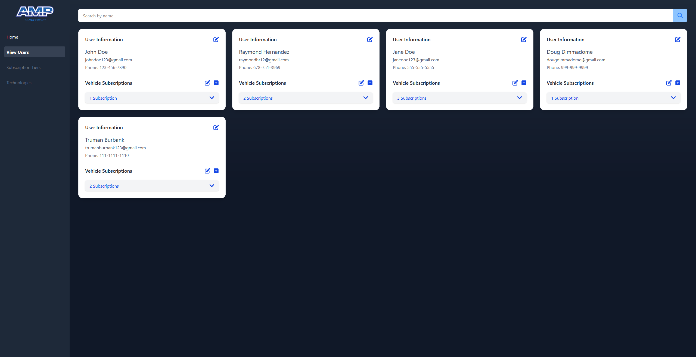
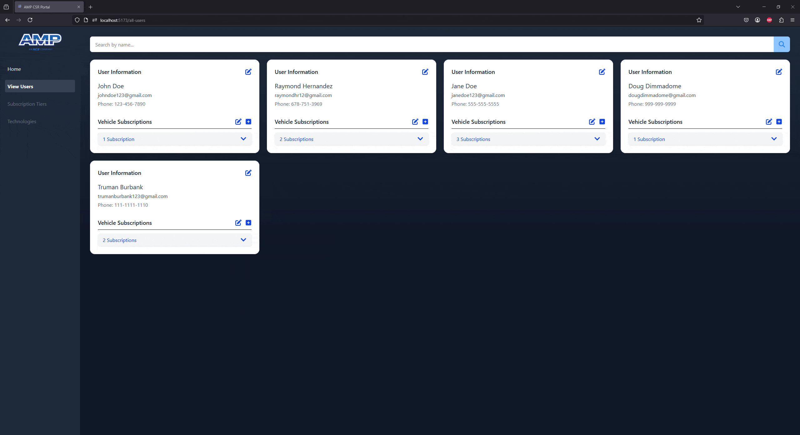
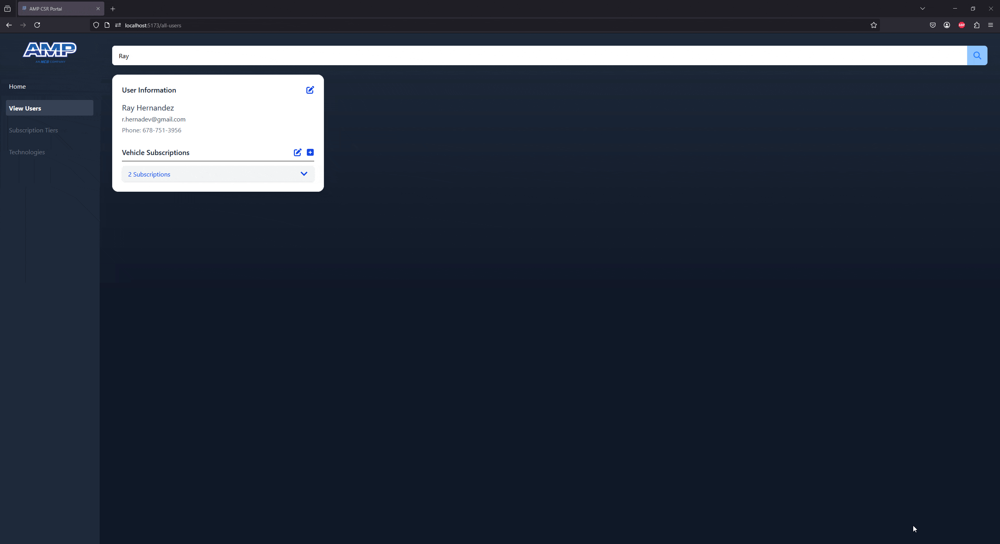
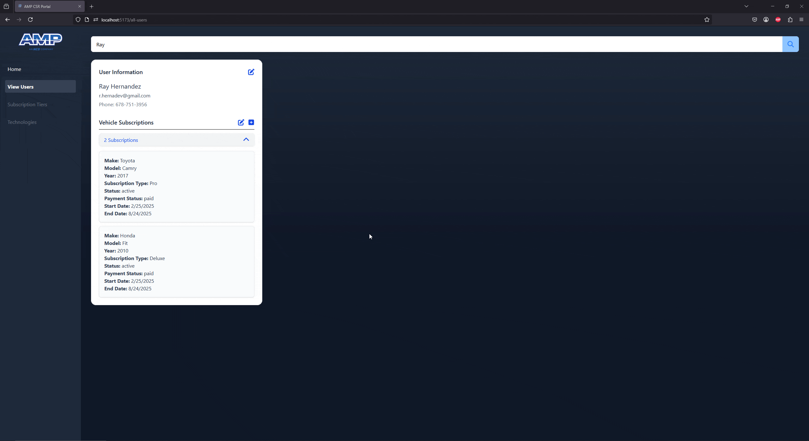

# amp-csr-portal

AMP CSR Portal is an easy to use and navigate web application that uses the scalable backend framework, Nestjs, to manage mock registered users and their carwash subscriptions.

## Features
- [X] CSR is able to view a list of users.
- [X] CSR is able to find and view details of specific users. Possible with search bar.
- [X] Registered users have the following data: name, email, phone and vehicle subscriptions.
- [X] CSRs are able to change user account information such as name, email, phone and other important information.
- [X] CSRs can view, edit, create and delete vehicle subscriptions of each registered user. Changes done via modals.
- [X] Site is responsive for mobile and desktop view.

## Technologies
### Frontend
- ReactJS
- HTML
- Tailwind CSS
- TypeScript
- Vite
### Backend
- NestJS
- MongoDB
- Node.js
### Additional Tools
- Axios
- Postman
- Vercel
- Git
- GitHub

## Demos
### Home

### View All Users

### Find Specific User + Edit Info

### Editing + Transferring Subscriptions

### Adding Subscription

### Deleting Subscription + Responsiveness Check

